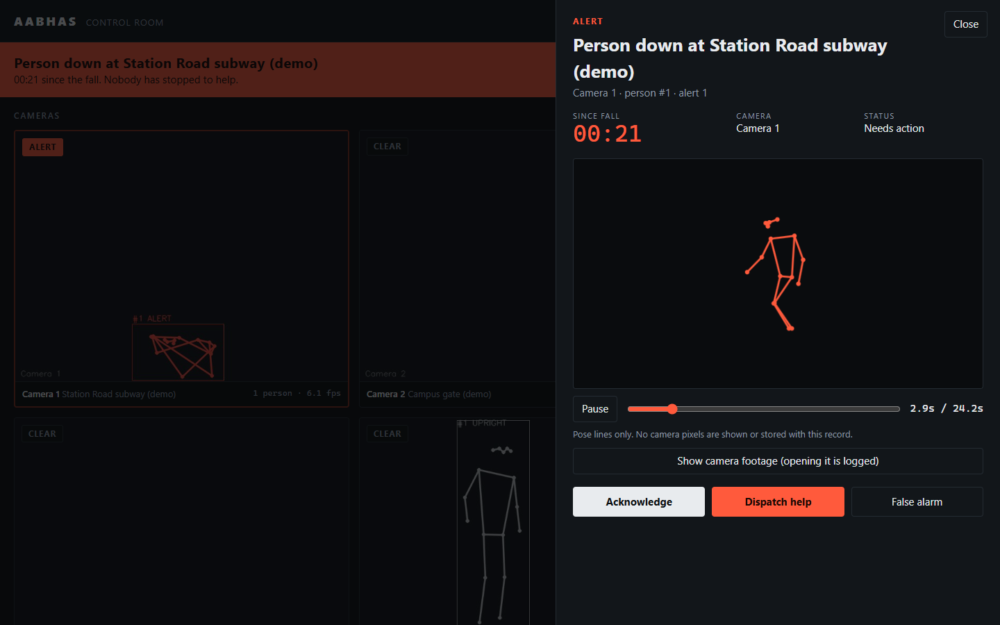
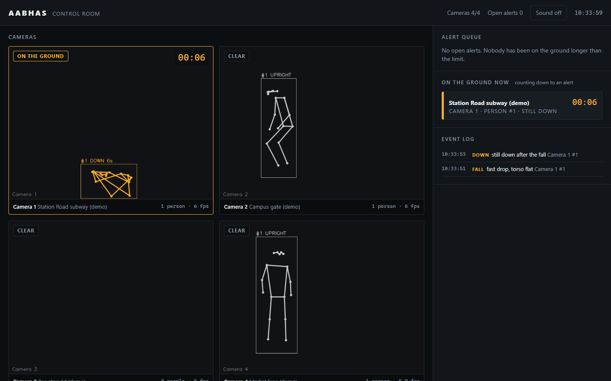
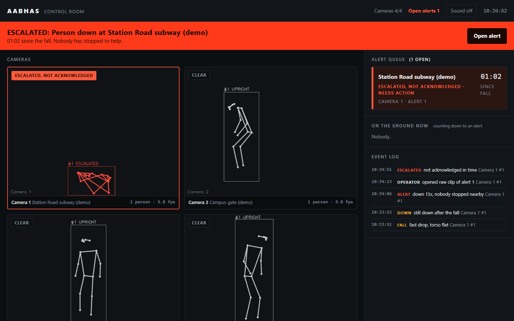
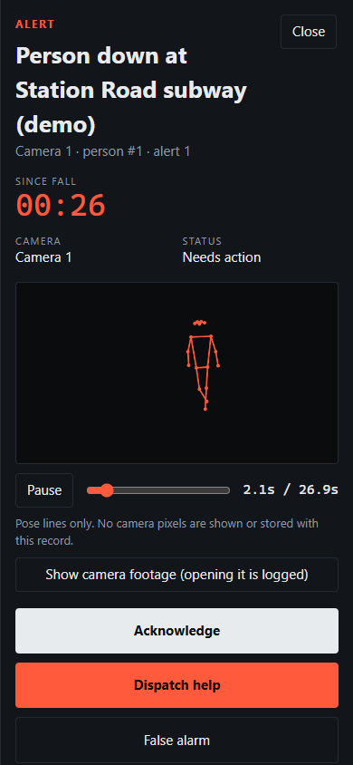

# Aabhas

**CCTV that notices when nobody else does.**

An old person trips on a street, a station platform or a campus walkway. He is unconscious and does not get up. People walk past and assume he is drunk. Aabhas watches the camera feed for that case. It finds people, tracks each one, spots a fall, checks that the person stays down, checks whether anyone has stopped to help, and if nobody has, raises an alert on the control room screen with the camera's location. The operator then sends help.

This is a student project. It is built and tested on public research video and on a short demo. It has never run on real outdoor CCTV. Read **Limits** before believing anything else here.



## Run it

Python 3.10, Windows or Linux. No GPU is needed (pose runs on CPU through ONNX).

```
python -m venv .venv
.venv\Scripts\activate            # Linux: source .venv/bin/activate
pip install -r requirements.txt
python demo.py
```

`demo.py` downloads four short clips from the UR Fall dataset (about 6 MB, non-commercial research data), builds a demo video and opens the control room at http://127.0.0.1:5000. On the first run `rtmlib` also downloads the two ONNX pose models (about 40 MB) into your user cache.

In the demo, Camera 1 plays a person walking in and falling at about 3 seconds. The timer in the demo config is 15 seconds, not 30. The alert appears about 18 seconds into the clip, and if nobody acknowledges it, it escalates 45 seconds after that. The whole flow takes about a minute. The other three tiles are looping clips of people walking about. The demo video holds the last frame of the fall clip, because the real clip ends a second or two after the person hits the floor. That held frame stands in for someone who does not move. It is not extra real footage.

For real cameras, copy `config/cameras.example.yaml` to `config/cameras.yaml`, edit it and run `python run.py --config config/cameras.yaml`. A camera source can be an RTSP URL, a webcam index or a video file. Every threshold is in `aabhas/config.py` and can be overridden per camera in the YAML.

Tests: `python -m pytest`.

## How it works

1. **Pose.** `rtmlib` runs a YOLOX person detector and RTMPose (17 keypoints) on every processed frame. This handles several people per frame.
2. **Tracking.** `aabhas/tracking.py` is an IoU plus centroid tracker. Tracks of people on the ground are kept for up to 90 s without a detection, because a person lying down is the one the detector loses.
3. **Fall logic.** `aabhas/fall_machine.py` is one explicit state machine per person, with no video or clock inside it:
   - `UPRIGHT` to `FALL`: the body centre drops by at least 0.3 body heights inside 1.5 s, faster than 0.5 body heights per second at its fastest, and the torso goes from upright to flat (or the box goes from tall to wide).
   - `FALL` to `DOWN`: still not standing 2 s later.
   - `DOWN` to `ALERT`: 30 s after the fall began (`down_seconds`) and nobody has stopped nearby.
   - Help: another person who stands still within 1.5 body heights of the fallen person for 3 s. A person who keeps walking does not count. Help gives `BEING_HELPED` (logged, lower priority).
   - Standing up gives `RECOVERED` (logged, no alert). An unacknowledged alert becomes `ESCALATED` after 180 s.
   - Someone lying down without a fast drop before it (sleeping on a pavement) goes to `LYING` and never alerts. Sitting down and tying shoelaces do not pass the trigger either.
   - Distances are in body heights and speeds in body heights per second, so one set of numbers covers near and far people. 34 unit tests script every transition and these edge cases.
4. **Privacy by skeleton.** The tiles, the event record and the default alert replay show pose lines on a blank background. Raw JPEG frames are kept in memory for 25 s and written to disk only when an alert fires. Opening them is a separate button, and it is written to the event log. They are deleted after `clip_retention_hours` (72 by default), or at once if the operator marks the alert a false alarm.
5. **Control room.** A Flask page with a tile for each camera, an alert queue (most urgent first) showing the location and time since the fall, a live countdown for anyone on the ground, a skeleton replay, Acknowledge, Dispatch help and False alarm buttons, and an event log.





## What I measured

Dataset: the [UR Fall Detection Dataset](http://fenix.ur.edu.pl/mkepski/ds/uf.html) (University of Rzeszow), camera 0 RGB video, 30 fall sequences and 40 daily-activity sequences, with frame labels. Videos were processed at 10 fps. Event level: a fall counts as detected if a `FALL` event fires from 1 s before the first "falling" frame to 3 s after the first "lying" frame. Delay is from the first "falling" frame.

I chose the thresholds on the odd-numbered sequences and then ran the even-numbered ones. Both are shown. Defaults in `aabhas/config.py` were not changed after looking at the even ones, except that I fixed a bug found on odd sequences first (the "before the fall" reference sample).

| Pose model | Split | Falls detected | Median delay | False FALL events on daily activities |
|---|---|---|---|---|
| balanced (YOLOX-m + RTMPose-m) | odd (used to choose) | 13 / 15 | 0.7 s | 2 in 2.4 min |
| balanced | **even (held out)** | **9 / 15** | 0.9 s | **3 in 2.6 min** |
| balanced | all | 22 / 30 | 0.85 s | 5 in 5.0 min |
| lightweight (YOLOX-tiny + RTMPose-s) | all | 17 / 30 | 0.77 s | 2 in 5.0 min |

- The daily-activity sequences total only 5 minutes, so "per hour" is not worth quoting. Several of the false events are on clips where the person deliberately lies down on the floor, which is close to a fall by design. None of these reached `ALERT`, because those clips never hold a position for 30 s.
- The fall clips end a second or two after the person lands, so the 30 s `DOWN` to `ALERT` step cannot be measured on real footage here. Repeating the last detections for 45 s (synthetic) gets 19 of the 30 clips to `ALERT`. This checks the chain, not accuracy. The `ALERT`, help and recovery paths are covered by unit tests and by the demo.
- Misses are mostly slow, crouching collapses where the torso stays upright in the image, and clips where the detector loses the person as soon as they are on the floor. Pose models are poor on people lying down (keypoint scores of 0.15 to 0.3 on a lying person, against 0.8 or more standing). The skeleton of a person on the ground often looks like a tangle.
- Speed: `balanced` took about 160 ms per frame on this laptop's CPU, `lightweight` about 30 ms. One `balanced` camera therefore runs at about 6 fps. Several cameras need `lightweight`, a smaller `process_fps`, or a GPU build of ONNX Runtime (not tested).

**The old BiLSTM.** I scored the original MediaPipe plus BiLSTM detector on the same 70 sequences (it never saw them): 23 of 30 falls found, but 133 false events in 5 minutes of daily activity. I also trained a small BiLSTM on RTMPose keypoints of the odd sequences and scored it on the even ones: 8 to 13 of 15 falls over five seeds, but 3 to 15 false events in 2 minutes, and it was trained on 15 falls filmed in one room with the same people. Neither beats the rules on false alarms, which is what an operator would feel. So the BiLSTM, the Altercation class and the synthetic training data were moved to `_old/`. Results are in `docs/results/`, and `eval/` has the scripts.

To reproduce: `python scripts/get_data.py`, `python eval/extract_poses.py --mode balanced`, `python eval/score_urfd.py --mode balanced --split test`.

## Limits

- The public datasets are **indoor, close range, one camera angle and one room** (a camera at roughly table height, people about 100 to 190 px tall in a 320x240 frame). **Outdoor CCTV performance is unknown.** I expect it to be worse.
- Night, rain, crowds that hide people, and cameras more than about 15 m away are untested.
- The thresholds need tuning per site and per camera angle. A steep overhead camera changes what "torso upright" looks like.
- "Help" means another person stopped and stood still nearby. A person who stops to stare or phone counts as help. A person who is hidden behind a crowd does not.
- A person who slowly lowers themselves to the ground, or who is already on the ground when first seen, never triggers the fall logic. That is on purpose (sleeping), and it also means a slow collapse is missed.
- The false-alarm numbers above come from 5 minutes of footage.
- No login on the control room by default. It listens on 127.0.0.1 only. If you bind it elsewhere, set `AABHAS_TOKEN` (see `.env.example`). Skeleton and raw clip files are not encrypted.
- Retention of raw clips is enforced by the app while it runs, and when it starts. Nothing deletes them if the app is never started again.
- Cameras are processed from file, webcam or RTSP in the code, but I could not test a webcam or an RTSP stream here.

## Also in here

- `docs/STAGED-FALLS.md`: how to film a safe test set with friends at CCTV height and score it with `scripts/score_clips.py`.
- **Littering hotspots (experimental)**: `aabhas/litter.py` and `scripts/litter.py`. Finds a new object that stays on the ground with a person near it when it appeared, and counts events per place and hour into a CSV and a chart. Tested only on synthetic frames. It does not say what the object is.
- `docs/PHASE3-PUBLIC-URINATION.md`: why I did not build public urination detection, and what would be needed first.

## Licences

Code: no licence file yet (Ganesh to choose). Libraries: `rtmlib` is Apache-2.0, YOLOX and RTMPose code are Apache-2.0, ONNX Runtime is MIT, OpenCV is Apache-2.0, Flask is BSD. The pose model weights were trained on public datasets (COCO, AI Challenger, CrowdPose and others) with their own terms, so check them before selling a product. The UR Fall dataset is CC BY-NC-SA 4.0 (non-commercial) and is downloaded, never shipped. I did not use Ultralytics YOLO because it is AGPL-3.0.
